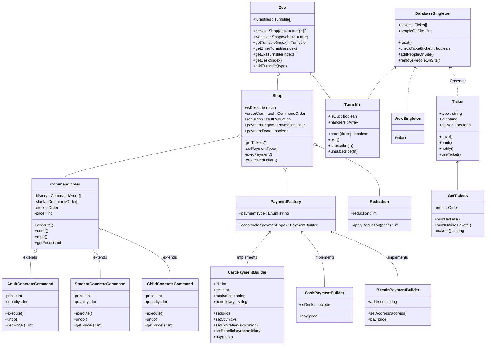

# BDPA

## Zoo cash desk

Within the zoo, design a cash register information system that allows the zoo to:

- sell tickets on a cash register (on-site)
- sell tickets online.

Cash register information system also supports:

- tariffs for various groups of customers (children, adults, students, ... )
- integration with turnstiles
- various reporting views

> ### Apply at least 5 different design patterns
>
> Apply at least 5 different design patterns when designing a zoo cash register system. At least three must be applied to address business requirements. The others can be applied to address the technical parts.

### Outputs

- High level design of the system
- Detailed design of particular parts of the system in which the chosen design patterns were applied
- Brief introduction of the applied patterns
- Explanation of the pattern usage
  - what the design pattern was used for
  - reasons of usage
  - evaluation of suitability
  - advantages
  - possible alternatives

## Global Schema

Fot more details, please go to [schema.md](https://github.com/iot-unicorn/cash-desk-zoo/blob/main/SCHEMA.md).

