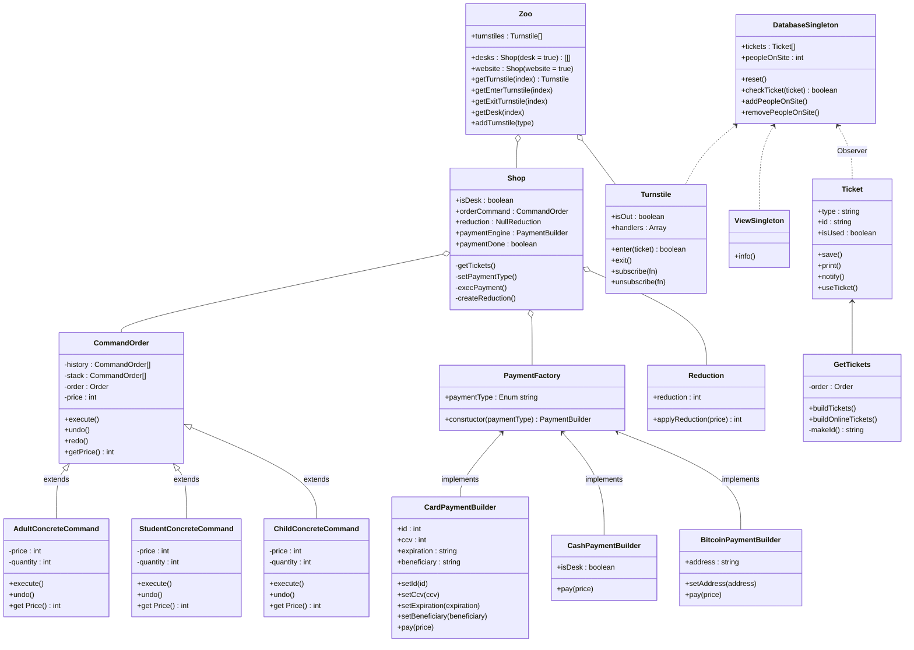
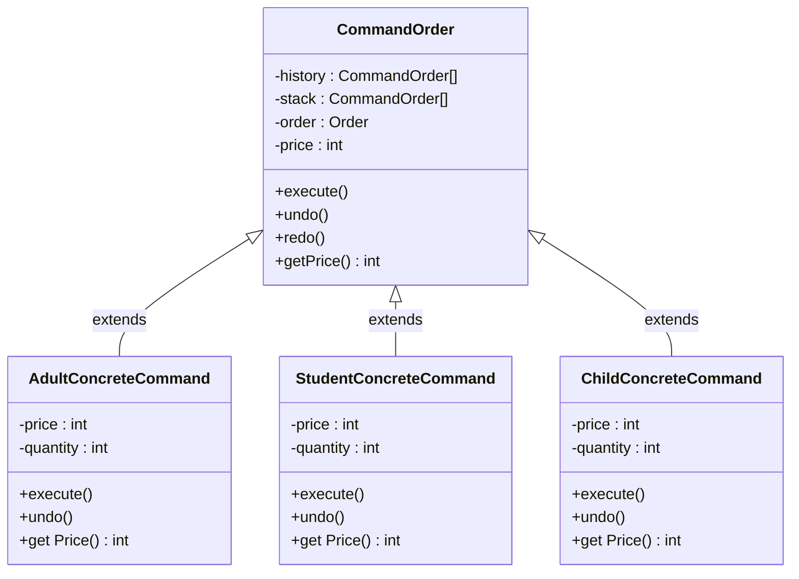
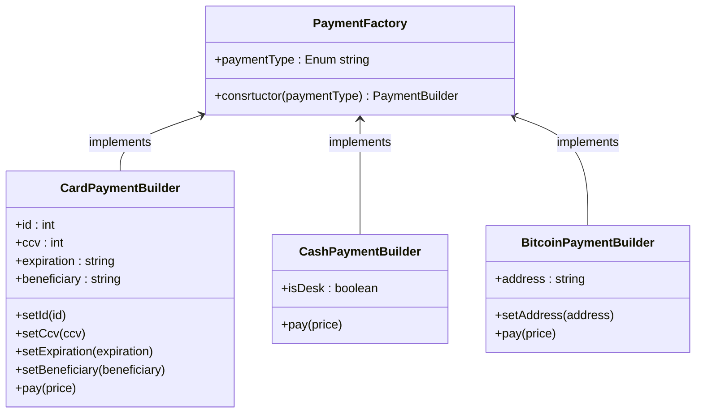
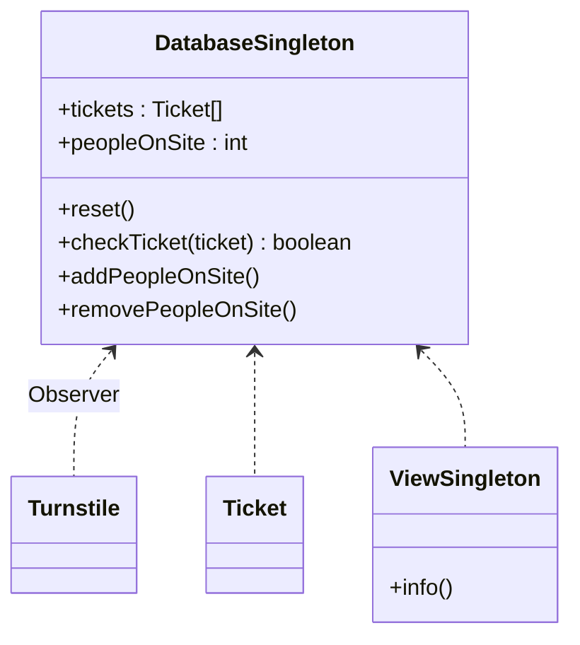
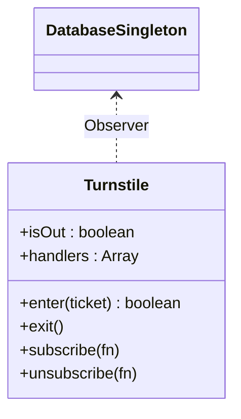

# Schemas

## Global Schema

## Command Pattern : Order System

+ **Reasons**:
    + The users can easily add and remove options of their order thanks to `undo` and `redo` functions.
+ **Evaluation of Suitability**:
    + Changes on code will be simple.
+ **Advantages**:
    + Native `undo` and `redo` functions.
    + Simple to add a new option for developers.
    + We can add reductions directly on these options.
+ **Alternatives**: Builder Design Pattern
    + The `undo` and `redo` functions will be more complex.
    + Change the code to add options will be more complex too.

## Factory & Builder Pattern : Payment System

**Factory Design Pattern**
+ **Reasons**:
    + Good way to select the right payment method
+ **Evaluation of Suitability**:
    + Easy to add a new payment method.
+ **Advantages**:
    + Create an interface for the payment methods.
+ **Alternatives**: Basic switch implementation
    + Not easily upgradable

**Builder Design Pattern**
+ **Reasons**:
    + We can create complex payment objects with many properties.
+ **Evaluation of Suitability**:
    + Simple to change payment implementation.
+ **Advantages**:
    + We must define all of the properties of the payment methods before pay.
+ **Alternatives**: Big constructor function
    + Many parameters on the constructor, this may be a problem to develop.

## Singleton Pattern : Database & View System

+ **Reasons**:
    + Only one instance to store the data in the application.
+ **Evaluation of Suitability**:
    + Add all methods and properties in one place.
+ **Advantages**:
    + No duplication of the data.
+ **Alternatives**: API Interface with Facade Design Pattern
    + Develepment cost will be higher.

## Observer Pattern : Turnstile System

+ **Reasons**:
    + Wait for change on turnstiles.
+ **Evaluation of Suitability**:
    + We can change the implementation of turnstile without broke the observer.
+ **Advantages**:
    + A better logic management.
+ **Alternatives**: Call a function when class is used
    + More complex implementation
    + Not really optimized

