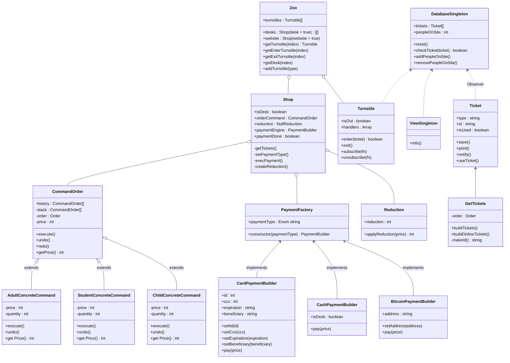
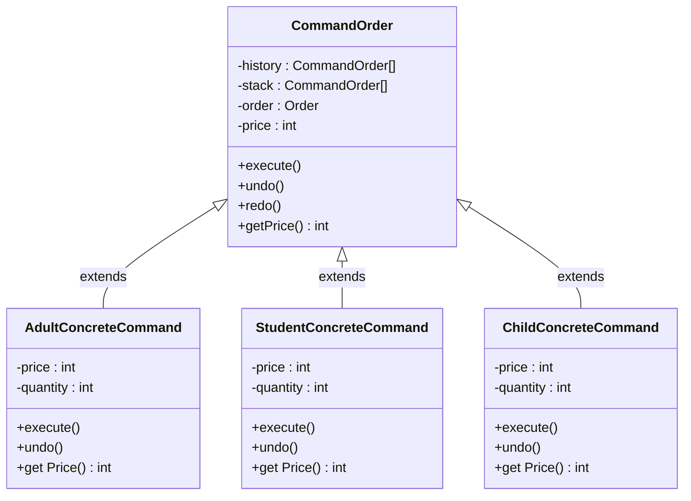
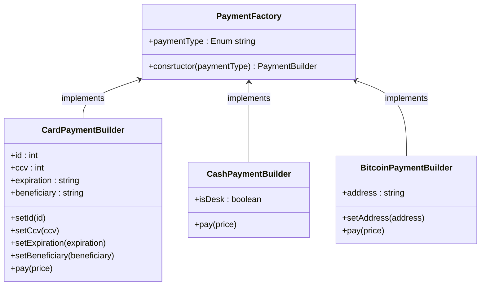
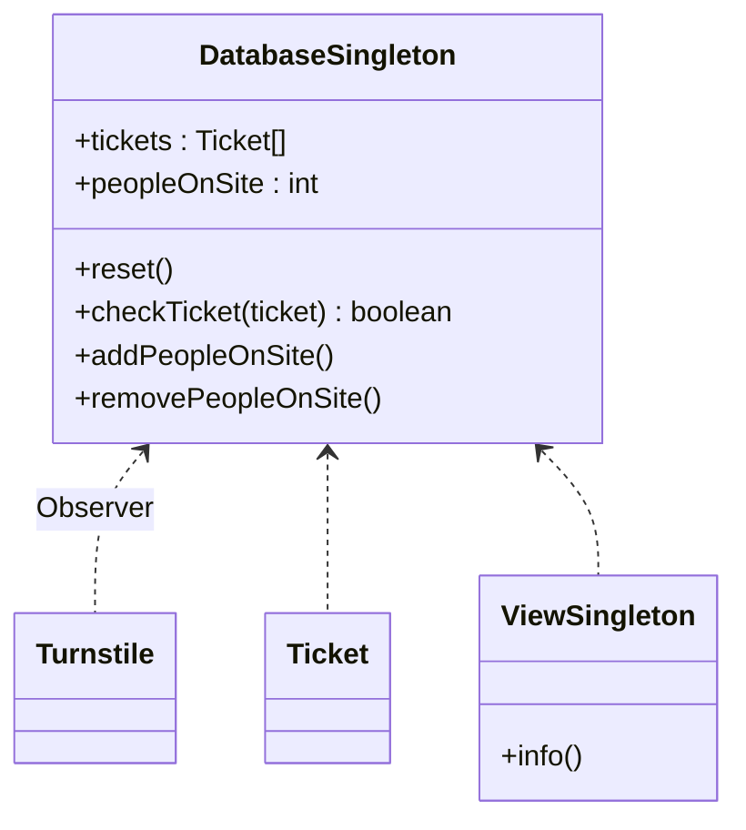
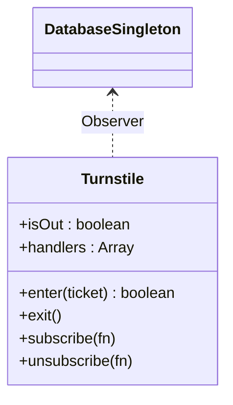

# Schemas

## Global Schema

## Command Pattern : Order System

## Factory & Builder Pattern : Payment System

## Singleton Pattern : Database & View System

## Observer Pattern : Turnstile System

